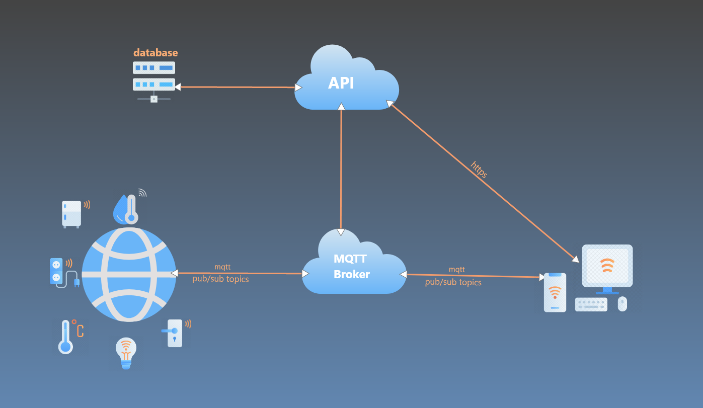

# Smart Home APP

----------

## ScreenShots from app

>If you found this useful give it ⭐

<p align="center">
 
  
 
  
</p>

> You can try application in [Web](https://mohamedanwer006.github.io/home),
> Some Features not yet support in web like image picker
> For try you can use this account👇
> Email : test@gmail.com
> Password  : 123456789
----------

```language
IOT system
```

 

----------

[Hardware (esp8266) repositorie](https://github.com/mohamedanwer006/iot-device)

[Backend repositorie](https://github.com/mohamedanwer006/home-api)
